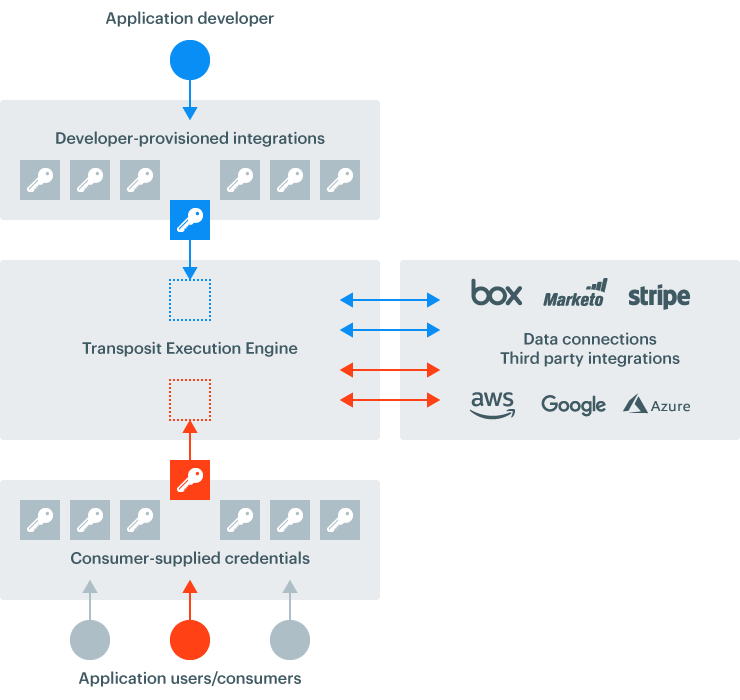

# Managed authentication

One of Transposit’s most powerful features is the way we manage authentication for you \(the app developer\) and your apps’ end users. Here are our high-level explanations for what exactly we mean when we say “managed auth” and how that allows you the freedom to develop applications without the burden of hard-coding authentication logic into every app.

If you'd like to jump straight to all our authentication options, including keys and keychains, API keys, and hosted app authentication, and endpoint deploy settings, see our Authentication reference. 



## **What is managed auth in Transposit?**

Transposit gives you tooling to centrally manage all aspects of authentication you'd run into while building a data-driven application with a "front door".

Imagine the following scenario: You, a developer, are trying to build an application that allows users to log in \(via Google\) and connect their own data from other services you’d like your app to integrate with \(i.e. GMail, Slack, Strava\). You also want to connect your application to data sources needed for all app users with your own permissions \(to APIs, databases, spreadsheets, etc\).

Here is what this process looks like when you're building with Transposit:

1. **Developer-provided authentication**
   1. You authenticate any data connections requiring developer permissions through Transposit
   2. Transposit stores and updates your developer-authenticated connections as necessary
2. **User-provided authentication**
   1. You enable single sign-on with Transposit for users to log in to the application
   2. You customize a Transposit-hosted connect page allowing users to authenticate their data connections \(Wireframe for connect page\)
3. **User management**
   1. Transposit creates list of user records mapping users’ logins to their data connections
   2. You can manage your application’s users and their data connections in Transposit

Here's a visualization of what Transposit's authentication solution looks like from the perspective of managing multiple, authenticated data connections, both developer and user-provided:

And here's a visualization of how Transposit allows you to manage your application's "front door" and user records:

## **Why is managed authentication useful?**

Generally, you may build apps using frameworks or platforms that provide you with generic identity management solutions. You may also use data integration services that handle how you authenticate with third party APIs. By having both those aspects of authentication managed by Transposit, you'll no longer have the headache of handling either of these with custom code in your application _and_ can take advantage of having them managed in one place.

This should make it easier to create and share **full application experiences** for your end users with simple authentication flows. Now, instead of sharing an automation workflow with a coworker by creating a long wiki for how they can replicated it with their own credentials, you can just build an application instead.

Finally, Transposit allows you to do all this while securely managing access to sensitive business data. You can safely share workflows and applications powered by data living in critical spreadsheets or databases, instead of managing multiple data sources for different audiences.

## **How does Transposit-managed authentication work in practice?**

To use Transposit as an authentication provider in your app, you’d copy/paste provided code into your app’s logic. Your app should also have a “connection settings” section which links out to a Transposit-hosted page \(that you can customize\) that gives the user a way to connect and disconnect authed services.

In Transposit, if you’re using “front door” identity management, there should be a way to manage a white list of users of your app, inspect user records, see what connections and authentications exist, and modify these as an admin.

To read more granular documentation around how to use authentication in Transposit in any of these cases, take a look at our Authentication section.

