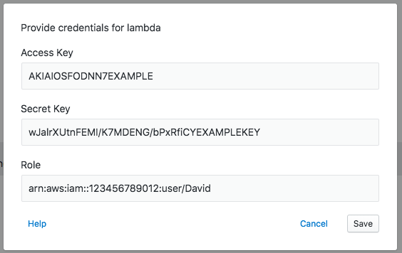

Here you can find details around Transposit's options for authentication, including keys and keychains, API keys, hosted app authentication, and endpoint deploy settings. For a high-level explanation, read about how we've designed [managed authentication in Transposit](../building/managed-authentication.md).

## Keys

Transposit supports several authorization mechanisms including OAuth, auth via headers, username/password, and a few less common options such as WSDL auth and OAuth v1. When you enter credentials (or complete an OAuth flow), Transposit securely stores them for future use as a key. Each Transposit application has its own keys that are not shared across applications, contexts, or organizations (unless using keychains; see below).

When first adding a data connection to your application, Transposit will ask you to authorize the connection. After adding a data connection, keys for that dependency can be added or removed from the Keys section of the Transposit operations console.

### Production keys

Transposit keeps separate sets of development and production keys. The keys shown in the Transposit operation console are for development. Adding or removing production keys is done via **Authentication > Production keys**.

From **Authentication > Production keys**, you can also require the user to provide the credentials for a data connection.

### Scheduled task keys

Keys used when running scheduled tasks are kept separate from development and production keys. You can add keys to a selected task via **Deploy > Scheduled tasks**.

## Keychains

Keychains are sets of keys that you can enable in development, production, or other contexts. You can also share keychains within an organization. Keychains are managed in Transposit via **Authentication > Keychains**.

In order to share keychains within an organization, create the keychain with the organization as the owner. Any keys put in that organization-owned keychain will be usable by others in the organization.

## Common Authorization Mechanisms

### Auth via OAuth v2 and OAuth v1

For most data connections that implement either version of OAuth, Transposit provides OAuth settings (i.e. application client IDs and secrets) for limited use, meaning the OAuth token exchange can be performed out-of-the-box to acquire an API access token for the data connection. If you do not want to use the Transposit-provided OAuth settings, you always have the option to overwrite the limited use settings with your own custom OAuth settings. A small subset of data connections will require you to provide custom OAuth settings because no feasible Transposit-provided OAuth settings exist for those connections.

You can modify OAuth settings by going to **Code > Data Connections** and finding your data connector. You can configure your own client ID and secret under **Authentication** or customize the scope under **Configuration**.

* [Github](https://developer.github.com/v3/?#authentication)
* [Google Analytics](https://developers.google.com/analytics/devguides/reporting/core/v4/authorization#OAuth2Authorizing)
* [Google Calendar](https://developers.google.com/calendar/auth#OAuth2Authorizing)
* [Google Directory](https://developers.google.com/admin-sdk/directory/v1/guides/authorizing#OAuth2Authorizing)
* [Google Drive](https://developers.google.com/drive/api/v3/about-auth#OAuth2Authorizing)
* [Google Mail](https://developers.google.com/gmail/api/auth/web-server)
* [Google Sheets](https://developers.google.com/sheets/api/guides/authorizing#OAuth2Authorizing)
* [Jira](https://developer.atlassian.com/cloud/jira/platform/jira-rest-api-oauth-authentication/) (requires custom OAuth settings)
* [Lyft](https://developer.lyft.com/docs/authentication)
* [Medium](https://github.com/Medium/medium-api-docs#21-browser-based-authentication)
* [Salesforce](https://developer.salesforce.com/docs/atlas.en-us.api_rest.meta/api_rest/quickstart_oauth.htm) (requires custom OAuth settings)
* [Shopify](https://help.shopify.com/en/api/getting-started/authentication/oauth) (requires custom OAuth settings)
* [Slack](https://api.slack.com/docs/oauth)
* [Spotify](https://developer.spotify.com/documentation/general/guides/authorization-guide/)
* [Strava](https://developers.strava.com/docs/authentication/)
* [Survey Monkey](https://developer.surveymonkey.com/api/v3/#authentication) (requires custom OAuth settings)

### Auth via header parameters

For data connections that implement authentication with header parameters, such as PagerDuty, the header parameter name (as documented by the external API site) and header parameter value (typically a secret token distributed by the external API site) must be provided when adding the connection to an application.

Example: [PagerDuty](https://v2.developer.pagerduty.com/docs/authentication)

* [PagerDuty](https://v2.developer.pagerduty.com/docs/authentication)
* [Yelp](https://www.yelp.com/developers/documentation/v3/authentication)

### Auth via query parameters

For data connections that implement authentication with query parameters, such as Zoom, only the query parameter value (typically a secret distributed by the external API site) must be provided when adding the connection to an application.

Example: [Zoom](https://zoom.github.io/api/#authentication)

* [Airtable](https://airtable.com/account)
* [Apify Crawler](https://www.apify.com/docs/api/v1#/introduction/authentication)
* [Giphy](https://developers.giphy.com/docs/)
* [Zoom](https://zoom.github.io/api/#authentication)

### Auth via AWS parameters

For AWS data connections, such as Lambda, the required combination of authentication parameters 'Access Key', 'Secret Key', and 'Role' depends on the authentication setup of your particular AWS service being connected to. The pair of 'Access Key' and 'Secret Key' authenticates you as an [IAM user](https://docs.aws.amazon.com/IAM/latest/UserGuide/id_credentials_access-keys.html), and the 'Role' can be used to specify the ARN of an [IAM role](https://docs.aws.amazon.com/IAM/latest/UserGuide/id_roles.html).

Example: Lambda with all three parameters provided (i.e. authentication as an IAM user assuming an IAM role)

* AWS Basic
* Elastic
* Lambda