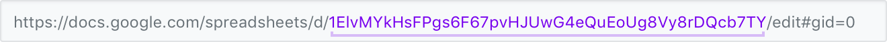

# Quickstart

{% embed data="{\"url\":\"https://youtu.be/tiN3zu9Ae28\",\"type\":\"video\",\"title\":\"Transposit Quickstart\",\"description\":\"Build a data-driven application using Transposit and Google Sheets.\",\"icon\":{\"type\":\"icon\",\"url\":\"https://www.youtube.com/yts/img/favicon\_144-vfliLAfaB.png\",\"width\":144,\"height\":144,\"aspectRatio\":1},\"thumbnail\":{\"type\":\"thumbnail\",\"url\":\"https://i.ytimg.com/vi/tiN3zu9Ae28/maxresdefault.jpg\",\"width\":1280,\"height\":720,\"aspectRatio\":0.5625},\"embed\":{\"type\":\"player\",\"url\":\"https://www.youtube.com/embed/tiN3zu9Ae28?rel=0&showinfo=0\",\"html\":\"<div style=\\\"left: 0; width: 100%; height: 0; position: relative; padding-bottom: 56.2493%;\\\"><iframe src=\\\"https://www.youtube.com/embed/tiN3zu9Ae28?rel=0&amp;showinfo=0\\\" style=\\\"border: 0; top: 0; left: 0; width: 100%; height: 100%; position: absolute;\\\" allowfullscreen scrolling=\\\"no\\\"></iframe></div>\",\"aspectRatio\":1.7778}}" %}

In this guide, you'll build a data-driven application using Transposit and Google Sheets.

## The scenario

People often store sets of business data in single, large spreadsheets to have a source of truth they can maintain in one place. Sometimes, they want to share subsets of that data to individuals \(coworkers, partners, customers, etc.\) without giving them access to the entire set or forcing them to sort through data that isn't meaninful to them.

Instead of maintaining different spreadsheets for different audiences, or manually sharing data when it's requested, it would be nice to create an interface that allows people to sign in and view data that they should have specific access to.

Now, suppose you have a spreadsheet where the first column is an email address indicating the owner of the data in that row. You want to give access to only the rows that belong to that owner. Google Sheets does not offer this functionality, but we can easily build this kind of customizable logic with Transposit.

By the end of this guide, you will have created a simple app that allows users to log in with their Google account and see a list of items that they've been given access to in said spreadsheet.

## What you'll need

You'll need a Transposit account, a Google account with access to Google Sheets, and a Google spreadsheet where each row has an email address for the person who has access to that row.

To make it easy, you can [copy this sample spreadsheet](https://docs.google.com/spreadsheets/d/1zwe5BJV8QrCK-WEGw5dt_kOPIRGmI_0Qw757bym21ow/copy) for use in this guide.

Here's the format of that spreadsheet, with data owner email addresses in the left column, and the data you want them to have access to in the right column:

| Date | Email | Cost |
| :--- | :--- | :--- |
| 8/05/2018 | you@domain.com | $20 |
| 8/10/2018 | you@domain.com | $30 |
| 9/05/2018 | iggy@transposit.com | $25 |
| 9/12/2018 | iggy@transposit.com | $45 |


Be sure to replace these email addresses with your own in one or more of the spreadsheet rows.


## 1. Create a new application

To begin a new project, [sign in to Transposit](http://api.transposit.com), and create a new _application_. An application is Transposit's representation of a set of functionality you want to build, and contains operations, data connections, keys to access data connections, and configurations for authentication and deployment.

Create your new application, give it a name, and pick the "Simple app" template for use in this guide.

## 2. View your app live

Each new Transposit application has basic hosting enabled automatically. Even if you outgrow this basic hosting later, it's still helpful for testing and sharing your app while it’s in development. If and when you _do_ need more control, you can use our [JavaScript SDK](../building/js-sdk.md) or directly call our [HTTP endpoints](../building/endpoints.md) from your app.

Transposit's hosting also requires sign in by default so that only you and the people you've authorized can view your application.

Look at the **Documentation** tab in the lower half of the code window. Find the link to the hosted app page in the manual to populate your published and available application, accessible to you only, by signing in with your Google account.

Once signed in, you'll see some stub data displayed. This data is populated by the `hello_world` operation that comes already deployed in every new application.

Go back to the Transposit code editor and select the `hello_world` operation to the code your app is calling. Any changes you make to the operation here will be reflected in your hosted app.

Try this out by adding Italian to the list of languages by replacing the code in this operation with the sample below:

```javascript
function hello_world() {
  return [
    {
      language: "english",
      message: "Hello, world"
    },
    {
      language: "spanish",
      message: "Hola, mundo"
    },
    {
      language: "italian",
      message: "Ciao Mondo"
    }
  ]
}
```

Click the **Commit code** button in the upper right to commit the changes. If you then go to the browser tab where your hosted app is open and refresh the page, you'll see the new data.


If you encounter an error, you can view logs in the Monitor tab under the code editor.



In this guide, we'll ask you to either _commit_ or _run_ code in your operations. Commiting code pushes any changes to already deployed operations to your hosted application; running code allows you to see the results of your current operation code locally in Transposit.


## 3. Add a data connector

Next you'll need to fetch the values from the spreadsheet, then filter those values to only return the rows owned by a given email address in the form that the hosted application expects.

To give your application access to data from other sources, you need to add each source as a _data connector_. Add a data connection to Google Sheets so you can query data stored in that spreadsheet:

* Click on the plus icon next to **Data connections** to add a data connector.
* Search for **Google Sheets** and add it.

Notice that you'll be prompted to authorize. Transposit allows you to use our OAuth application credentials so you can get instant access to your data. But you can also supply your own credentials later on to customize the authorization screen.

## 4. Use SQL to query your data

Now that you've connected your Sheets data to your application, you need to add functionality allowing your application to query the contents of this sheet. You'll do this by creating a new _operation_. Operations are callable units of work that can be written in JavaScript or SQL.

* Add a new operation by clicking the plus icon next to **Operations**.
* Choose **SQL from template** and then choose the template operation `get_sheet_values`.

This template shows all of the possible parameters available to the API in this operation. Some parameters in Transposit templates are required, and some are optional.

For this application, you only need to specify `spreadsheetId` and `range`. The `spreadsheetId` can be copied from the document's URL:



You can fill in the information for the private spreadsheet you created or copied, and it should look something like this:

```sql
SELECT * FROM google_sheets.get_sheet_values
  WHERE range='Sheet1'
  AND spreadsheetId='<INSERT YOUR SPREADSHEET ID>'
  /**
  You can comment out or delete unused parameters:

  AND dateTimeRenderOption='SERIAL_NUMBER | FORMATTED_STRING'
  AND majorDimension='DIMENSION_UNSPECIFIED | ROWS | COLUMNS'
  AND valueRenderOption='FORMATTED_VALUE | UNFORMATTED_VALUE | FORMULA'
  AND quotaUser='<string>'
  **/
```

* Now click the **Run** button and you should see your results.
* You'll notice that the results are something like the following, showing you your sheet data row by row.

```text
[
  {
    "range": "Sheet1!A1:Z999",
    "majorDimension": "ROWS",
    "values": [
      [
        "hello@transposit.com",
        "This is some sample data that is available"
      ],
      ...
    ]
  }
]
```

Transposit introduces a few conveniences to SQL for working with JSON, including [EXPAND BY](../references/sql-operations.md). You'll want to use the `EXPAND BY` syntax here to return one item for each nested row so the values will be easier to manipulate and display later.


Note: Since `values` is a SQL keyword, it must be escaped with backticks.


Try expanding the results:

```sql
SELECT * FROM google_sheets.get_sheet_values
  WHERE range='Sheet1'
  AND spreadsheetId='<INSERT YOUR SPREADSHEET ID>' EXPAND BY `values`
```


In addition to passing through parameters in your SQL statement, you can also filter out the result values in the `WHERE` clause. See the [SQL quickstart](sql-quickstart.md) and the [SQL reference](../references/sql-operations.md) for more information.


## 5. Mix in JavaScript

Sometimes it's easiest to use a bit of JavaScript to manipulate data and encode some business logic. In this case, since the result of the Google Sheets call is fairly unstructured, let's use JavaScript to give it a bit of structure.

* Click the new operation button and select JavaScript.
* Replace your JavaScript operation with the following code to filter out rows that match:

```javascript
function run(params) {
  var results = api.run('this.get_sheet_values_1').filter(function(item) {
    return item.values[1] === api.user().email;
  }).map(function(item) {
    return {
      message: item.values[0] + ': ' + item.values[2]
    }
  });
  if (results.length === 0) {
    return {
      message: 'There are no spreadsheet rows available to ' + api.user().email
    };
  } else {
    return results;
  }
}
```

* You can give this operation a friendlier name like `get_user_messages` by clicking on the **Properties** tab.
* Commit all your code by clicking the **Commit code** button one more time.


In the commented code there's a method named `api.run` that is available for you to call other operations. This can include data sources \(e.g. google\_sheets, similar to the SQL interface\) as well as other operations in your application using the `this` syntax. You can also do things like access the current user using `api.user()`. See the [JavaScript Operations Reference](../references/js-operations.md) for more information.


## 6. Deploy your operation

By default, the HTTP endpoints for your operations \(other than the default `hello_world` operation we created for you\) are private. Since this hosted app should be able to call our newly created operation, you need to deploy that new operation.

* Click the **Deploy**  in the navigation menu.
* Find your `get_user_messages` operation and select **Deployed**
* Since we require user information \(i.e. the user's email\), ensure the **Require user sign-in** checkbox is checked.
* Click the **Save** button to save your configuration changes.

## 7. Set production keys

Now that you've deployed your application, you need to give your users access to the spreadsheet data.

The credentials you add in the development console are for use in development only. You can choose to have your users provide required credentials, or provide them for all your users. In this case, since only you have access to your spreadsheet, you will provide the required credentials for your users.

* Click **Authentication** in the navigation.
* Select the **Production Keys** section.
* Click the **Add key** button, select `google_sheets`, and authorize.

This uses the keys you've just personally provided in the context of running the application in production for other users.

To see more authentication options, refer to [Authentication](../building/authentication.md).

## 8. Putting it all together

Now you're ready to have your hosted application display the results of your new operation.

* Return to your application's code
* Go to your hosted app template by clicking on the **Page template** section
* Replace `transposit.runOperation("hello_world");` with `transposit.runOperation("get_user_messages")` \(line 55 in the hosted app page markup\).
* Click **Preview** to see the results. \(Note that any time you make a change to code or to the template, you need to click this button again to see the changes in the preview. Reloading the preview will not work.\)
* Now that you see that it working in the preview, return to Transposit and commit your code changes so that you'll see it in the public link that you can once again access from your application manual.

You should now see printed any data from the spreadsheet rows where you were listed as the data owner!


If you get an error \("There are no spreadsheet rows available to `your email`."\), you will need to return to your spreadsheet, make sure at least one of the emails in the left column is your own, and refresh your application.


## 9. Making it available to everyone

By default, your hosted app is available to only you. To make it available to more people, either add users to the whitelist or make it public:

* Click **Authentication** in the navigation.
* You can choose **Allow sign in from any Google account**, or add your GSuite domain name, or add individual email addresses to the whitelist.
* Click the **Save** button to save any changes you've made.

Your app is now live!

## Related topics

* [Allowing user-supplied keys through the managed connect page](../building/authentication.md)
* [Integrating multiple data sources together](sql-quickstart.md)

